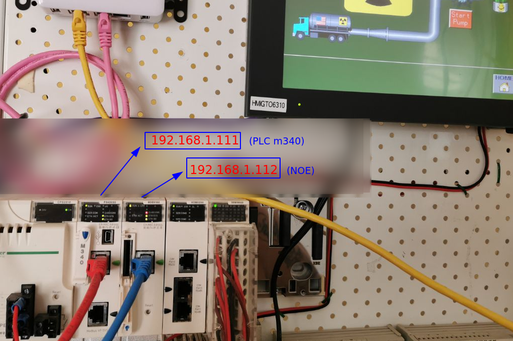
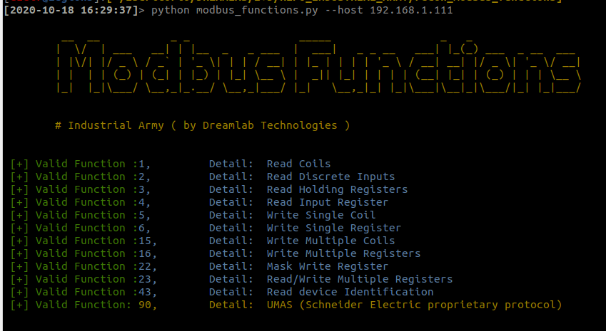
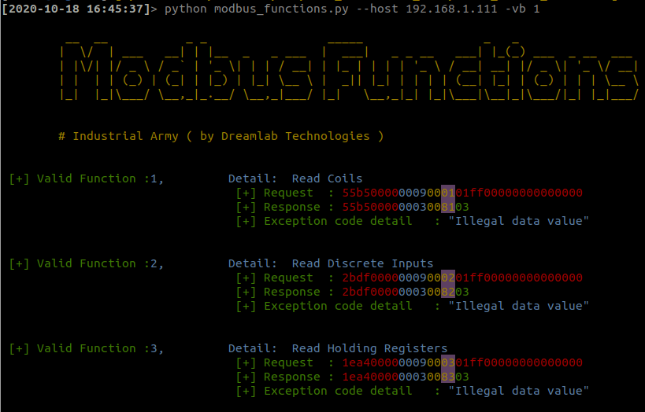

# MODBUS FUNCTIONS !!!
Recognition of implemented "MODBUS" functions

## Uso / usage

	usr@pwn:~$ python modbus_functions.py --host <modbus host>

## help
	usr@pwn:~$ python modbus_functions.py --help
	
	usage: modbus_functions.py [-h] [-v] [--sid SID] --host HOST [--port PORT]
	                           [-vb {1,0}]

	[+] Recognition of implemented "MODBUS" functions.

	optional arguments:
	  -h, --help     show this help message and exit
	  -v, --version  show program's version number and exit
	  --sid SID      Slave ID
	  --host HOST    Host
	  --port PORT    Port
	  -vb {1,0}      Verbose mode

	[+] Demo: modbus_functions.py <modbus host>

***

# TOOL: "Modbus Functions"

## Quick start

	usr@pwn:~$ git clone https://github.com/industrialarmy/recon_modbus_functions.git
	usr@pwn:~$ cd recon_modbus_functions/
	usr@pwn:~$ python modbus_functions.py --host <modbus host>

## Test board

POC:  

Verbose mode:

Details verbose mode:

